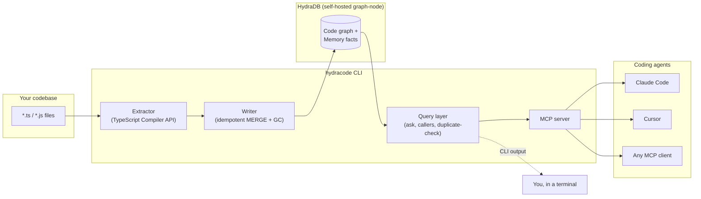
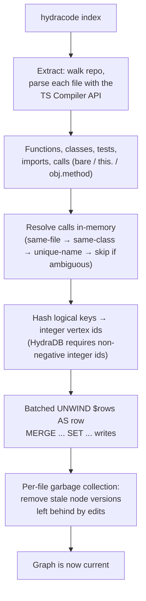
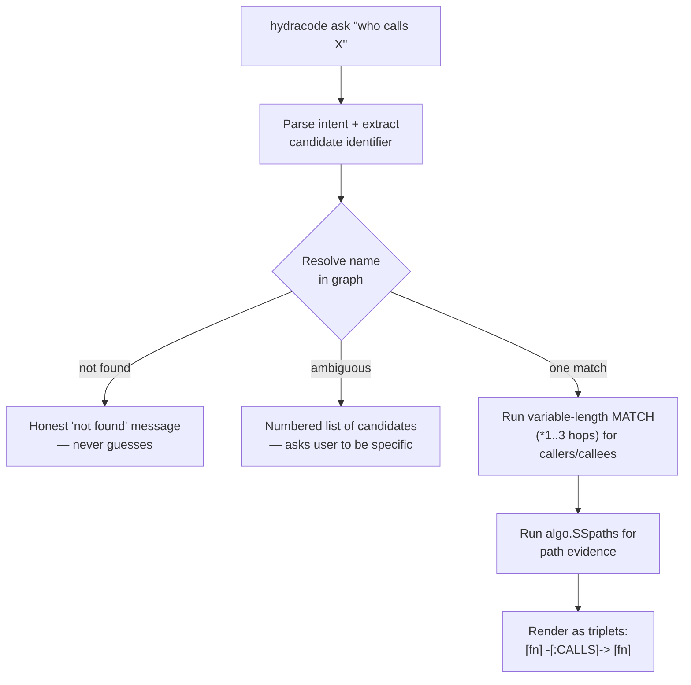
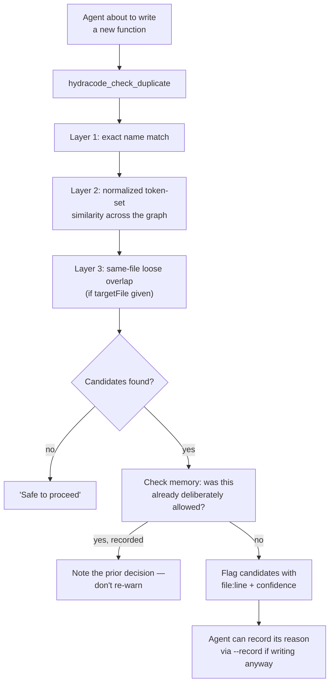

# hydracode

**Turn any codebase into a queryable knowledge graph in [HydraDB](https://github.com/hydra-db/hydradb) — so AI coding agents get real call-chain evidence instead of embedding-similarity guesses.**

---

## Hack Hydra submission

| | |
|---|---|
| **Primary track** | 02B — Repos, Dependencies & Code as Graphs |
| **Secondary track** | 03 — Memory & Context Retrieval (memory facts + `SUPERSEDED_BY` + deliberate-duplicate recording) |
| **Demo video** | <!-- DEMO: add URL --> |

**What judges should look at in the 3-minute video:**

1. `hydracode index` — walks the repo, parses every `.ts`/`.js` file, writes real nodes (File / Function / Class) + edges (CONTAINS / CALLS / IMPORTS) into HydraDB as a graph
2. `hydracode ask "who calls writeExtractedFiles"` — multi-hop graph traversal returns the actual call-chain evidence (not a similarity guess)
3. `hydracode check-duplicate "writeExtractedFiles"` — flags existing near-duplicates *before* an agent writes redundant code
4. MCP tool call — same graph query through the Model Context Protocol, verified working with Grok Build (`grok mcp doctor hydracode` → handshake OK, 11 tools)

---

## The problem

AI coding agents are good at writing individual functions and bad at maintaining codebase coherence. The most common complaint across developer communities isn't "the code is wrong" — it's **duplicated logic and inconsistent patterns**, because most agent tooling retrieves context by *semantic similarity* ("this looks related") instead of *actual structure* ("this is provably called by that, three hops away").

Agents also have no durable memory of team decisions between sessions, and no way to check "does this already exist?" before writing new code.

hydracode fixes this by giving agents a real, queryable graph instead of a vector index.

---

## What it does

| Capability | Command | What makes it different |
|---|---|---|
| Index a codebase into a graph | `hydracode index` | Functions, classes, files, imports, and call relationships — written as real nodes and edges in HydraDB, not chunks in a vector store |
| Ask structural questions | `hydracode ask "who calls X"` | Returns call-chain **evidence** + related memory facts + security findings in one response — a provable relationship, not a similarity score |
| Catch duplicate logic before it's written | `hydracode check-duplicate "newFunctionName"` | Flags existing functions with similar names/purpose *before* an agent writes a redundant one — and can record *why* a near-duplicate was intentional, so it's never re-flagged |
| Remember project decisions | `hydracode memory record` / `memory recall` | Persists decisions and conventions in the graph, linked to the actual code they concern |
| Keep AGENTS.md honest | `hydracode sync-agents-md` | Auto-generates a graph-derived section of AGENTS.md (high fan-in functions, most-connected files, honest test-coverage status) — kept in sync with the real codebase instead of hand-written and stale |
| Never go stale | `hydracode index --watch`, `hydracode init-hooks` | Live file watcher + a git post-commit hook that reindexes automatically — no one has to remember to re-run anything |
| Work with any MCP agent | `hydracode mcp`, `hydracode install` | A full MCP server exposing every capability above as a tool, plus one command to auto-wire it into Cursor and Claude Code |

---

## Architecture



### Indexing pipeline



### `ask` — multi-hop retrieval with evidence



### `check-duplicate` — pre-write gate



---

## Getting started

### 1. Run HydraDB

**Fastest — prebuilt image (recommended):**

```bash
git clone https://github.com/DiverseXL/hydracode.git
cd hydracode
cp .env.example .env   # set HYDRADB_DEV_TOKEN
docker compose -f docker-compose.yml -f docker-compose.published.yml up -d
curl http://127.0.0.1:8443/healthz   # should return 200
```

This pulls a prebuilt image from GHCR — no local Rust toolchain, no ~90-minute native build.

**From source (if you want to build HydraDB yourself):**

```bash
docker compose up --build -d
```

Expect a genuinely long first build (native Rust + `libcypher-parser` + SuiteSparse GraphBLAS compile). Subsequent builds reuse Docker's layer cache.

**Native (WSL/Linux, no Docker):** see [HydraDB's own README](https://github.com/hydra-db/hydradb) for the Rust toolchain + system dependency setup. hydracode's `.env`/config work identically either way — only the connection URI changes.

### 2. Install hydracode

```bash
npm install
npm run build
```

### 3. Configure

```bash
export HYDRACODE_HYDRADB_URI=http://127.0.0.1:8443
export HYDRACODE_HYDRADB_TOKEN=<same value as HYDRADB_DEV_TOKEN in .env>
export HYDRACODE_HYDRADB_ALLOW_PLAINTEXT=true
```

Or use a project-level `.hydracode/config.json` (gitignored) — see `src/config.ts` for the full schema, including TLS/production mode (`allowPlaintext: false` + `https://` URI + a real bearer token).

### ⚡ 60-second quick start

Once HydraDB is running and the env vars are set, try these four commands to see the full pipeline in action:

```bash
# 1. Index this repo (writes real nodes + edges into HydraDB)
node dist/cli.js index .

# 2. Ask a structural question — returns actual call-chain evidence
node dist/cli.js ask "who calls writeExtractedFiles"

# 3. Check if a name already exists — catches near-duplicates
node dist/cli.js check-duplicate "writeExtractedFiles"

# 4. Try a name that definitely doesn't exist — confirms the safe path
node dist/cli.js check-duplicate "calculateFooBarBaz123"
```

### 4. Index your project

```bash
node dist/cli.js index .
```

### 5. Ask it something

```bash
node dist/cli.js ask "who calls writeExtractedFiles"
```

### 6. Wire it into your coding agent

**Cursor / Claude Code** (auto-detect):

```bash
node dist/cli.js install
```

Auto-detects and writes MCP config for Cursor (`.cursor/mcp.json`) and Claude Code (`.mcp.json` / `~/.claude.json`), merging with any existing servers rather than overwriting. Restart your agent afterward to pick it up.

**Grok Build:**

```bash
# After build:
grok mcp add hydracode -- node dist/mcp/server.js

# Or without building (dev mode):
grok mcp add hydracode -- npx tsx src/mcp/server.ts

# Verify:
grok mcp doctor hydracode   # should show handshake OK, 11 tools
```

---

## Visualizing the graph

```bash
node dist/cli.js visualize
# exports hydracode-graph.html — open in any browser
```

Exports the full indexed code graph as an interactive, self-contained HTML file powered by D3.js. Nodes are color-coded by type (blue = File, orange = Function, green = Class) and sized by connection count — **high fan-in nodes (functions called by many others) are visibly larger**, which is a good visual signal for "change this carefully." Click any node to highlight its direct neighbors and dim everything else; scroll to zoom, drag to pan. No server needed — just open the file in any browser.

---

## Security findings (SARIF import)

```bash
node dist/cli.js import-sarif ./results.sarif
# or via any SARIF-compatible scanner:
# codeql database analyze --format=sarif-latest --output=results.sarif
# npx eslint src/ --format @microsoft/eslint-formatter-sarif
```

Ingests security findings from any SARIF 2.1.0-compatible scanner (CodeQL, ESLint SARIF formatter, Semgrep, etc.) as `SecurityFinding` nodes in the graph. Each finding is linked via `AFFECTS` edges to the `Function` node whose line range contains it, and always to the `File` node as a fallback. This makes `impact` queries include vulnerability context — "what's the blast radius of this vulnerability" is the same graph traversal as "what's the blast radius of changing this function." A finding's transitive reach through `CALLS` edges is a reachability problem — not answerable by a vector store.

---

## Command reference

| Command | Description |
|---|---|
| `hydracode index [--path <dir>] [--watch] [--changed-only]` | Index (or re-index) a codebase. `--watch` runs a live file watcher with debounced incremental reindexing. `--changed-only` indexes just the files touched in the last git commit. |
| `hydracode visualize [--output <path>]` | Export the indexed code graph as an interactive, self-contained HTML page with a D3.js force-directed visualization. Default output: `hydracode-graph.html`. |
| `hydracode ask "<question>" [--max-hops <n>]` | Ask a structural question; returns call-chain structure + related memory facts + security findings in one response. |
| `hydracode status` | Show whether the current graph is indexed, and basic counts (files/functions/classes/tests). |
| `hydracode check-duplicate "<name>" [--file <path>] [--record "<reason>"]` | Check whether a proposed function name/purpose likely already exists. `--record` persists a deliberate-duplicate decision so future checks don't re-flag it. |
| `hydracode memory record "<text>" [--about <name>] [--supersedes <key>]` | Record a project decision or convention, optionally linked to a specific function/class/file. `--supersedes` marks an older fact as replaced (SUPERSEDED_BY edge) so stale decisions never win over current ones. |
| `hydracode memory recall [query] [--about <name>] [--near <name>]` | Recall previously recorded decisions. `--near` returns facts about a node AND its file + call neighborhood — no text match needed. Combine with a query to narrow by topic. |
| `hydracode memory list [--all]` | Browse all active memory facts. `--all` includes superseded facts to see the full decision history. |
| `hydracode sync-agents-md` | Generate or update the auto-generated section of `AGENTS.md` from the live graph. Preserves any hand-written content outside the markers. |
| `hydracode init-hooks` | Install a git `post-commit` hook that automatically reindexes changed files after every commit. |
| `hydracode callers <symbol> [--max-hops <n>]` | Find all functions that call a given function (transitive). Default 3 hops. |
| `hydracode callees <symbol> [--max-hops <n>]` | Find all functions that a given function calls (transitive). Default 3 hops. |
| `hydracode impact <symbol> [--max-hops <n>]` | Full blast radius: callers + callees + call-chain paths as evidence. |
| `hydracode import-sarif <file> [--tool <name>]` | Import SARIF security findings into the code graph as SecurityFinding nodes. |
| `hydracode mcp` | Start the MCP server on stdio — this is what an MCP client launches as a subprocess. |
| `hydracode install` | Auto-write MCP configuration for Cursor and Claude Code. |

### MCP tools (exposed via `hydracode mcp`)

| Tool | Mirrors | Notes |
|---|---|---|
| `hydracode_status` | `status` | |
| `hydracode_index` | `index` | Always runs quiet (no stdout pollution — required for a clean MCP stdio stream) |
| `hydracode_ask` | `ask` | Returns structured JSON, not colored terminal text |
| `hydracode_check_duplicate` | `check-duplicate` | Description is written to invite agents to call it *before* writing new code |
| `hydracode_callers` | `callers` | `{ symbol, maxHops? }` — typed callers list with file locations |
| `hydracode_callees` | `callees` | `{ symbol, maxHops? }` — typed callees list with file locations |
| `hydracode_impact` | `impact` | `{ symbol, maxHops? }` — callers + callees + call-chain path evidence |
| `hydracode_import_sarif` | `import-sarif` | `{ content: string, tool? }` — ingest raw SARIF JSON, returns `SarifWriteSummary` |
| `hydracode_record_decision` | `memory record` | Accepts `about` and `supersedesKey` — mark old decisions as replaced so they're filtered from recall |
| `hydracode_recall_memory` | `memory recall` | Accepts `nearNode` for proximity retrieval — facts about a node's call/file neighborhood, not just text matches |
| `hydracode_list_memory` | `memory list` | Browse all active facts; `includeSuperseded` option shows full decision history |

CLI and MCP paths share the exact same underlying pipeline functions — there is no forked logic between "what a human sees" and "what an agent sees."

---

## Memory layer

hydracode includes a temporal memory layer that lets agents record and recall project decisions, conventions, and rationales — so the same question isn't re-debated every session.

### Recording decisions

```bash
node dist/cli.js memory record "Use tsc --incremental for faster rebuilds" --about writeExtractedFiles
```

Records a `MemoryFact` node in the graph, optionally linked via an `ABOUT` edge to a specific function, class, or file. Use `--supersedes <key>` to mark an older fact as replaced — the old fact's status changes to `superseded` and it is automatically filtered out of normal recall, so stale decisions never win over current ones.

### Recalling decisions

```bash
# Text search across all facts
node dist/cli.js memory recall "incremental build"

# Facts linked to a specific node
node dist/cli.js memory recall --about writeExtractedFiles

# Proximity recall — facts about a node AND its call/file neighborhood
node dist/cli.js memory recall --near writeExtractedFiles
```

The `--near` flag is the key differentiator from a vector store. A vector store finds facts that *mention* a function by name. Proximity recall finds facts about *anything that function calls* or *anything in the same file* — one graph traversal, no text match required. When combined with a query, proximity is the primary signal and the text narrows the results (intersection, not union).

### Browsing all facts

```bash
node dist/cli.js memory list        # active facts only
node dist/cli.js memory list --all  # include superseded facts
```

### MCP tools

The same memory operations are available as MCP tools for coding agents:

- `hydracode_record_decision` — record a fact with optional `about` and `supersedesKey`
- `hydracode_recall_memory` — recall with `query`, `about`, or `nearNode` (proximity)
- `hydracode_list_memory` — browse all facts, with `includeSuperseded` option

---

## How HydraDB is used (meaningful, not decorative)

hydracode is useless without HydraDB's graph model. Vectors alone cannot answer "who calls this function, transitively, three hops out" — that requires a native graph traversal. Here's what HydraDB actually does:

- **Code entities as nodes.** Every file, function, class, test, and module is a real node in HydraDB with an integer id (HydraDB requires non-negative integer ids — strings are rejected). Logical keys like `function:src/graph/writer.ts#writeExtractedFiles#503` are hashed to integers at write time and stored as a `key` property for human readability.
- **Relationships as edges.** `CONTAINS` (file → function/class/test), `CALLS` (function → function), `IMPORTS` (file → module), `EXTENDS` (class → class), `METHOD_OF` (function → class) — all written as typed edges with their own integer ids.
- **Writes are idempotent `UNWIND $rows` + `MERGE`.** Re-running `index` updates existing nodes instead of duplicating them. A per-file garbage-collection pass removes stale node versions left behind by edits.
- **Reads are multi-hop graph traversals.** Variable-length `MATCH (*1..3)` for reachable-endpoint questions ("who calls X?"). `algo.SSpaths` when actual path structure is needed as evidence. These are native HydraDB operations — not a BFS written in JS.
- **Memory facts live in the same graph.** `MemoryFact` nodes are linked to code via `ABOUT` edges (e.g. `MemoryFact -[:ABOUT]-> Function`). `SUPERSEDED_BY` edges connect old decisions to their replacements. Proximity recall traverses `CALLS` + `CONTAINS` from an anchor to find all neighboring node ids, then fetches memory facts pointing at any of them — a query structurally impossible for a flat store.
- **Security findings are graph-connected too.** `SecurityFinding` nodes link to `Function` and `File` via `AFFECTS` edges. "Which vulnerabilities affect my call chain?" is the same graph traversal as "what's the blast radius of changing this function."

> **hydracode is a HydraDB application, not a HydraDB wrapper.** The entire value proposition — call-chain evidence, proximity recall, duplicate detection, impact analysis — is delivered through HydraDB's graph engine. Without it, there is no multi-hop traversal, no path evidence, no memory-to-code linkage.

### Developer details (if you're extending this)

HydraDB isn't incidental — it's the storage and query engine for the entire project. A few things worth knowing if you're extending this:

- **Vertex and relationship ids must be non-negative integers**, not strings. Logical identity (e.g. `file:src/cli.ts#someFunction#42`) is computed once, then hashed to a 53-bit integer (safe within a JSON double, avoiding precision loss) via FNV-1a. The original string is kept as a `key` property for readability.
- **`MERGE` matches by `id` alone** for vertices (no label filter — label is attached afterward via `SET n:Label`), but **relationship `MERGE` requires the type in the pattern** (`MERGE (a)-[r:CALLS {id: ...}]->(b)`). These are asymmetric, confirmed by reading HydraDB's own parser source.
- **No `ON CREATE` / `ON MATCH`** — every write is a single unconditional `SET` after `MERGE`.
- **Batched writes use `UNWIND $rows AS row`** with the row list passed as a real JSON parameter (`{"parameters": {"rows": [...]}}`), not inlined into the query text — inline list literals are rejected by the parser.
- **Multi-hop retrieval** uses two mechanisms depending on what's needed: variable-length `MATCH` (`(a)-[:CALLS*1..3]->(b)`) for reachable-endpoint questions, and the `algo.SSpaths` procedure when the actual path structure (not just endpoints) is needed as evidence.
- **`RETURN` only supports `binding.property` or `count(*)`** in the row-execution grammar — whole-node/whole-path projections aren't allowed outside the `algo.*paths` procedures.
- **A per-file garbage-collection pass** runs at the end of every write: since an edited function's line-number-based key changes on edit (by design — an edit *is* a new fact), the old version would otherwise persist as an orphan. GC diffs the current write against what's already linked to each re-indexed file and removes anything stale, scoped strictly to files actually touched in that run.

All of the above were verified against HydraDB's live source and a running instance — not assumed from documentation, since several of them (integer-only ids, relationship-type-required-in-MERGE, no grouped-aggregation-by-default-assumption) are not what a Neo4j-familiar developer would expect by default.

- **The memory layer stores `MemoryFact` nodes with `ABOUT` edges** linking decisions to the specific `Function`, `ClassEntity`, or `File` nodes they concern. `SUPERSEDED_BY` edges connect old decisions to the facts that replace them, making fact currency unambiguous — the node's `status` field is the authoritative signal, not edge traversal. **Proximity recall** traverses `CALLS` and `CONTAINS` edges from an anchor node to find all neighboring node ids, then fetches `MemoryFact` nodes with `ABOUT` edges pointing at any of those ids — a query that is structurally impossible for a flat memory store.
- **`SecurityFinding` nodes with `AFFECTS` edges to `Function` and `File` nodes** enable "which functions in my call chain have known vulnerabilities" as a native graph traversal. The same `CALLS`-chain traversal that powers `impact` queries also surfaces security context — a finding's transitive reach is a graph reachability problem, not a text-match problem.

### What breaks without HydraDB

- **Multi-hop call chains:** variable-length `MATCH (*1..3)` is a native graph traversal — not reproducible with SQLite or vectors without writing your own BFS
- **Path evidence:** `algo.SSpaths` returns the actual node/edge sequence — not just endpoints
- **Memory linked to code:** `MemoryFact -[:ABOUT]-> Function` connects decisions to the exact nodes they concern, queryable alongside the code graph in the same store
- **Security in context:** `SecurityFinding -[:AFFECTS]-> Function` means vulnerability blast radius is the same query as change blast radius
- **Proximity recall:** traversing `CALLS` + `CONTAINS` to find neighboring memory facts is a graph query — a flat store has no equivalent
- **Idempotent re-indexing:** `UNWIND $rows AS row MERGE` is a single atomic batch — not a read-modify-write cycle

---

## Known limitations

Being upfront about these rather than hiding them:

- **Call extraction is heuristic, not type-checked.** The extractor captures bare identifier calls (`foo()`), `this.foo()`, and `obj.method()` where the object's type can be inferred syntactically in-file (a `new ClassName()` or a typed parameter). It does **not** perform full cross-file type resolution — calls through untyped parameters, destructured objects, or dynamically returned instances won't be captured. Precision was prioritized over recall throughout: an incorrect edge is worse than a missing one.
- **Path evidence is anchor-outward only.** `algo.SSpaths` returns paths *from* the resolved node outward, so asking "who calls X" gives you the caller list but not path evidence for the callers themselves — only for what the anchor node calls onward.
- **Test coverage linking isn't implemented yet.** Test nodes are extracted, but nothing currently links a test to the code it covers, so `sync-agents-md`'s test-coverage section is honest about this rather than reporting a misleading "0 untested functions."
- **File deletion isn't reconciled.** If a file is removed from disk, its previously-indexed nodes remain in the graph until a full re-index or manual cleanup — the GC pass only cleans up stale versions *within* files that were actually re-indexed in a given run.
- **`CONTRADICTS` edges are defined in the schema but not yet wired into the memory layer.** `SUPERSEDED_BY` is fully implemented (explicit replacement). The symmetric conflict detection (`CONTRADICTS` — two facts about the same node that disagree) is a natural extension, not built yet.
- **Multi-type variable-length patterns are rejected.** Writing `MATCH (a)-[:CALLS|CONTAINS*1..3]->(b)` fails — HydraDB requires exactly one relationship type per variable-length pattern. The workaround is two separate queries with different types, merged in JS.
- **Variable-length `*0..N` minimum-hop is not supported.** The minimum is `*1..N` — a 0-hop self-inclusion (e.g. `CALLS*0..1` to also return the anchor node) is rejected. When the anchor itself needs to be in the result set, it must be added explicitly.
- **`UNWIND MATCH` does not support `WHERE`.** The error is `"UNWIND MATCH does not support OPTIONAL, hints, or WHERE"` — so `UNWIND $ids AS nid MATCH (m)-[:ABOUT]->({id: nid}) WHERE m.status = 'active'` fails. The workaround is to fetch all active facts and filter in JS, which is efficient given the memory graph's small size.
- **SARIF findings are matched to `Function` nodes by line-range containment** (`finding.startLine` within `function.startLine..endLine`) — findings outside any indexed function's range are linked to the `File` node only.
- **SARIF results with no `physicalLocation` are skipped** (some tools emit location-free findings).
- **The git post-commit hook runs synchronously on Windows/Git Bash** (a background-subshell quirk observed during development), typically completing in well under a second for incremental reindexes — negligible in practice, but worth knowing if you're extending it.

---

## Tech stack

- **CLI:** TypeScript / Node.js, [Commander](https://github.com/tj/commander.js)
- **Graph store:** [HydraDB](https://github.com/hydra-db/hydradb) (self-hosted `graph-node`), queried over its HTTP/OpenCypher API
- **Code extraction:** TypeScript Compiler API (no `ts-morph` or other wrapper — direct `ts.createProgram`)
- **Agent integration:** [`@modelcontextprotocol/sdk`](https://github.com/modelcontextprotocol/typescript-sdk) (MCP server, stdio transport)
- **Config validation:** Zod
- **Containerization:** Docker, multi-stage build with a diagnostic audit stage + BuildKit cache mounts for a resumable native Rust compile
- **CI/CD:** GitHub Actions, publishing to GHCR on every push to `main` and on version tags

---

## Project structure

```
src/
  cli.ts                  CLI entrypoint (commander)
  config.ts                Config loading + validation
  install.ts                Cursor/Claude Code MCP config writer
  hydra/
    client.ts                HTTP client for HydraDB's query API
    errors.ts                 Typed error classes
  extract/
    tsExtractor.ts             TypeScript Compiler API extraction
  graph/
    schema.ts                   Shared node/edge type definitions
    writer.ts                    Batched idempotent writes + GC
    query.ts                      Retrieval primitives (findByName, getCallers, getPathEvidence, ...)
    askPipeline.ts                  Shared ask logic (CLI + MCP)
    duplicateCheck.ts                Duplicate-detection logic
    agentsSummary.ts                  Graph-derived AGENTS.md content
    hashId.ts                          String key -> integer vertex id
    visualize.ts                       Graph visualization data + HTML export
  memory/
    store.ts                             MemoryFact read/write
  mcp/
    server.ts                             MCP server (all tools)
docker/
  hydradb.Dockerfile                       HydraDB build (source + audit stages)
  entrypoint.sh                             Runtime config for graph-node
scripts/
  smoke-test.ts, index-self.ts, ...          Verification scripts used during development
```

---

## Roadmap

These are the natural next steps — not built yet, but the graph schema and MCP surface are designed to extend cleanly:

- **npm publish** — `package.json` is already configured with `bin: { hydracode }`, ready to publish once the Docker setup UX is tighter
- **SARIF CI integration** — run `hydracode import-sarif` as a post-scan step in GitHub Actions to keep the security graph current alongside the code graph
- **VS Code sidebar extension** — the MCP server's structured output is designed to be consumed by an IDE extension; a sidebar showing call-graph context around the current file is the natural next surface
- **Shared remote HydraDB** — TLS + read tokens for team-shared graph (config already supports `https://` URIs and non-plaintext mode)
- **`CONTRADICTS` edges on memory facts** — symmetric conflict detection (two facts about the same node that disagree), complementing the existing `SUPERSEDED_BY` explicit replacement
- **SARIF import from MCP** — already built as `hydracode_import_sarif`; CI pipeline integration coming
- **Change-set mode** — given a git diff, list impacted symbols from the graph without re-indexing everything
- **Test coverage edges** — link `Test` nodes to the `Function`s they cover (currently extracted but not linked)

---

## License

AGPL-3.0-or-later — matching HydraDB's own license, since this project depends on it as a core component.

---

## Acknowledgments

Built for [Hack Hydra](https://hackhydra.hydradb.com), August 2026. Every non-obvious HydraDB engine constraint referenced in this README (integer-only ids, `MERGE` semantics, grammar restrictions, path-procedure syntax) was verified by reading HydraDB's actual source and testing against a running instance — not assumed from prose documentation.
