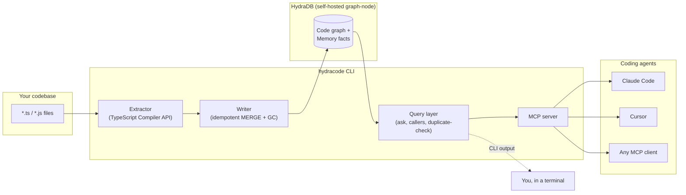
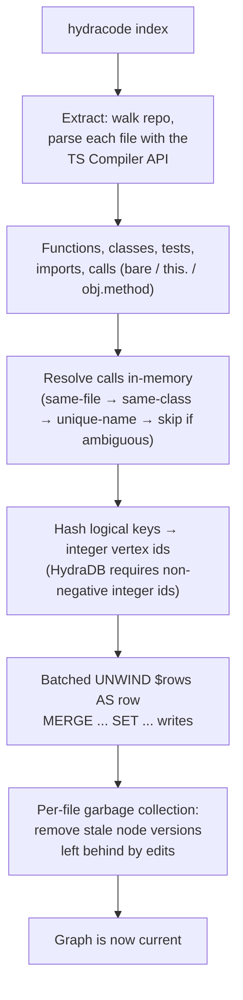
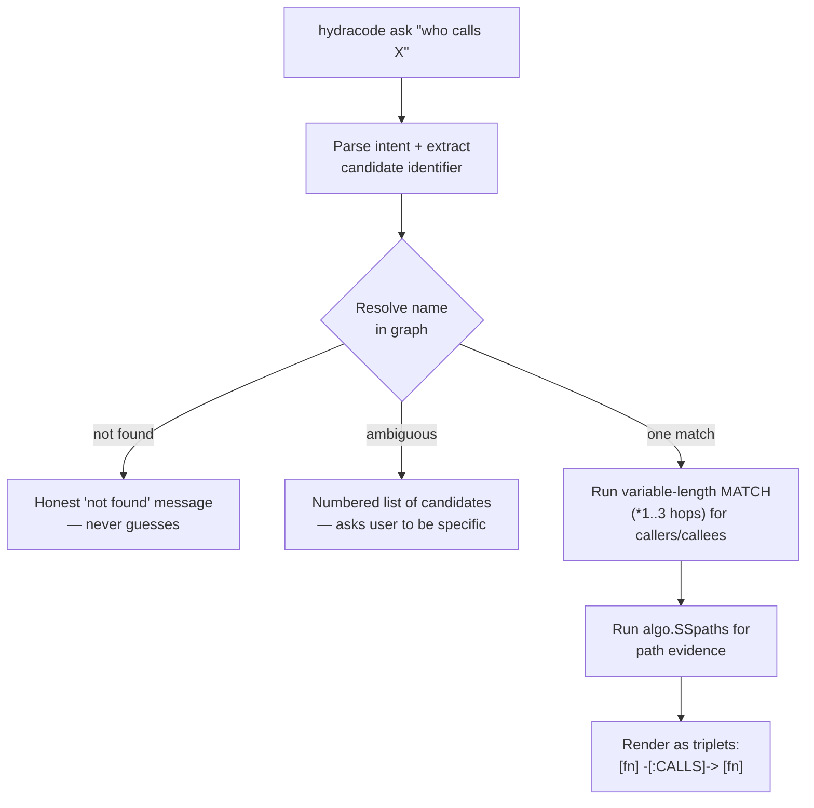
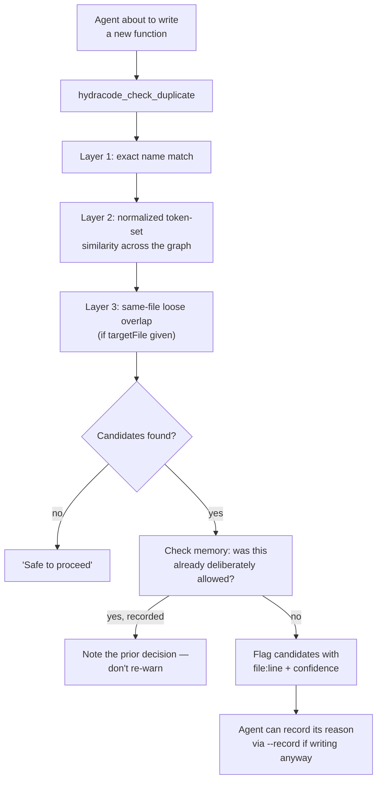

# hydracode

**Turn any codebase into a queryable knowledge graph in [HydraDB](https://github.com/hydra-db/hydradb) — so AI coding agents get real call-chain evidence instead of embedding-similarity guesses.**

Built for [Hack Hydra](https://hackhydra.hydradb.com) (Track 02B: Repos, Dependencies & Code as Graphs).

---

## The problem

AI coding agents are good at writing individual functions and bad at maintaining codebase coherence. The most common complaint across developer communities isn't "the code is wrong" — it's **duplicated logic and inconsistent patterns**, because most agent tooling retrieves context by *semantic similarity* ("this looks related") instead of *actual structure* ("this is provably called by that, three hops away").

Agents also have no durable memory of team decisions between sessions, and no way to check "does this already exist?" before writing new code.

hydracode fixes this by giving agents a real, queryable graph instead of a vector index.

---

## What it does

| Capability | Command | What makes it different |
|---|---|---|
| Index a codebase into a graph | `hydracode index` | Functions, classes, files, imports, and call relationships — written as real nodes and edges in HydraDB, not chunks in a vector store |
| Ask structural questions | `hydracode ask "who calls X"` | Returns actual call-path **evidence** (`[fn] -[:CALLS]-> [fn]`), not just a list — a provable relationship, not a similarity score |
| Catch duplicate logic before it's written | `hydracode check-duplicate "newFunctionName"` | Flags existing functions with similar names/purpose *before* an agent writes a redundant one — and can record *why* a near-duplicate was intentional, so it's never re-flagged |
| Remember project decisions | `hydracode memory record` / `memory recall` | Persists decisions and conventions in the graph, linked to the actual code they concern |
| Keep AGENTS.md honest | `hydracode sync-agents-md` | Auto-generates a graph-derived section of AGENTS.md (high fan-in functions, most-connected files, honest test-coverage status) — kept in sync with the real codebase instead of hand-written and stale |
| Never go stale | `hydracode index --watch`, `hydracode init-hooks` | Live file watcher + a git post-commit hook that reindexes automatically — no one has to remember to re-run anything |
| Work with any MCP agent | `hydracode mcp`, `hydracode install` | A full MCP server exposing every capability above as a tool, plus one command to auto-wire it into Cursor and Claude Code |

---

## Architecture



### Indexing pipeline



### `ask` — multi-hop retrieval with evidence



### `check-duplicate` — pre-write gate



---

## Getting started

### 1. Run HydraDB

**Fastest — prebuilt image (recommended):**

```bash
git clone https://github.com/DiverseXL/hydracode.git
cd hydracode
cp .env.example .env   # set HYDRADB_DEV_TOKEN
docker compose -f docker-compose.yml -f docker-compose.published.yml up -d
curl http://127.0.0.1:8443/healthz   # should return 200
```

This pulls a prebuilt image from GHCR — no local Rust toolchain, no ~90-minute native build.

**From source (if you want to build HydraDB yourself):**

```bash
docker compose up --build -d
```

Expect a genuinely long first build (native Rust + `libcypher-parser` + SuiteSparse GraphBLAS compile). Subsequent builds reuse Docker's layer cache.

**Native (WSL/Linux, no Docker):** see [HydraDB's own README](https://github.com/hydra-db/hydradb) for the Rust toolchain + system dependency setup. hydracode's `.env`/config work identically either way — only the connection URI changes.

### 2. Install hydracode

```bash
npm install
npm run build
```

### 3. Configure

```bash
export HYDRACODE_HYDRADB_URI=http://127.0.0.1:8443
export HYDRACODE_HYDRADB_TOKEN=<same value as HYDRADB_DEV_TOKEN in .env>
export HYDRACODE_HYDRADB_ALLOW_PLAINTEXT=true
```

Or use a project-level `.hydracode/config.json` (gitignored) — see `src/config.ts` for the full schema, including TLS/production mode (`allowPlaintext: false` + `https://` URI + a real bearer token).

### 4. Index your project

```bash
node dist/cli.js index .
```

### 5. Ask it something

```bash
node dist/cli.js ask "who calls writeExtractedFiles"
```

### 6. Wire it into your coding agent

```bash
node dist/cli.js install
```

Auto-detects and writes MCP config for Cursor (`.cursor/mcp.json`) and Claude Code (`.mcp.json` / `~/.claude.json`), merging with any existing servers rather than overwriting. Restart your agent afterward to pick it up.

---

## Command reference

| Command | Description |
|---|---|
| `hydracode index [--path <dir>] [--watch] [--changed-only]` | Index (or re-index) a codebase. `--watch` runs a live file watcher with debounced incremental reindexing. `--changed-only` indexes just the files touched in the last git commit. |
| `hydracode ask "<question>" [--max-hops <n>]` | Ask a structural question; returns results plus path evidence where available. |
| `hydracode status` | Show whether the current graph is indexed, and basic counts (files/functions/classes/tests). |
| `hydracode check-duplicate "<name>" [--file <path>] [--record "<reason>"]` | Check whether a proposed function name/purpose likely already exists. `--record` persists a deliberate-duplicate decision so future checks don't re-flag it. |
| `hydracode memory record "<text>" [--about <name>]` | Record a project decision or convention, optionally linked to a specific function/class/file. |
| `hydracode memory recall "<query>" [--about <name>]` | Recall previously recorded decisions. |
| `hydracode sync-agents-md` | Generate or update the auto-generated section of `AGENTS.md` from the live graph. Preserves any hand-written content outside the markers. |
| `hydracode init-hooks` | Install a git `post-commit` hook that automatically reindexes changed files after every commit. |
| `hydracode mcp` | Start the MCP server on stdio — this is what an MCP client launches as a subprocess. |
| `hydracode install` | Auto-write MCP configuration for Cursor and Claude Code. |

### MCP tools (exposed via `hydracode mcp`)

| Tool | Mirrors | Notes |
|---|---|---|
| `hydracode_status` | `status` | |
| `hydracode_index` | `index` | Always runs quiet (no stdout pollution — required for a clean MCP stdio stream) |
| `hydracode_ask` | `ask` | Returns structured JSON, not colored terminal text |
| `hydracode_check_duplicate` | `check-duplicate` | Description is written to invite agents to call it *before* writing new code |
| `hydracode_record_decision` | `memory record` | |
| `hydracode_recall_memory` | `memory recall` | |

CLI and MCP paths share the exact same underlying pipeline functions — there is no forked logic between "what a human sees" and "what an agent sees."

---

## How this uses HydraDB

HydraDB isn't incidental — it's the storage and query engine for the entire project. A few things worth knowing if you're extending this:

- **Vertex and relationship ids must be non-negative integers**, not strings. Logical identity (e.g. `file:src/cli.ts#someFunction#42`) is computed once, then hashed to a 53-bit integer (safe within a JSON double, avoiding precision loss) via FNV-1a. The original string is kept as a `key` property for readability.
- **`MERGE` matches by `id` alone** for vertices (no label filter — label is attached afterward via `SET n:Label`), but **relationship `MERGE` requires the type in the pattern** (`MERGE (a)-[r:CALLS {id: ...}]->(b)`). These are asymmetric, confirmed by reading HydraDB's own parser source.
- **No `ON CREATE` / `ON MATCH`** — every write is a single unconditional `SET` after `MERGE`.
- **Batched writes use `UNWIND $rows AS row`** with the row list passed as a real JSON parameter (`{"parameters": {"rows": [...]}}`), not inlined into the query text — inline list literals are rejected by the parser.
- **Multi-hop retrieval** uses two mechanisms depending on what's needed: variable-length `MATCH` (`(a)-[:CALLS*1..3]->(b)`) for reachable-endpoint questions, and the `algo.SSpaths` procedure when the actual path structure (not just endpoints) is needed as evidence.
- **`RETURN` only supports `binding.property` or `count(*)`** in the row-execution grammar — whole-node/whole-path projections aren't allowed outside the `algo.*paths` procedures.
- **A per-file garbage-collection pass** runs at the end of every write: since an edited function's line-number-based key changes on edit (by design — an edit *is* a new fact), the old version would otherwise persist as an orphan. GC diffs the current write against what's already linked to each re-indexed file and removes anything stale, scoped strictly to files actually touched in that run.

All of the above were verified against HydraDB's live source and a running instance — not assumed from documentation, since several of them (integer-only ids, relationship-type-required-in-MERGE, no grouped-aggregation-by-default-assumption) are not what a Neo4j-familiar developer would expect by default.

---

## Known limitations

Being upfront about these rather than hiding them:

- **Call extraction is heuristic, not type-checked.** The extractor captures bare identifier calls (`foo()`), `this.foo()`, and `obj.method()` where the object's type can be inferred syntactically in-file (a `new ClassName()` or a typed parameter). It does **not** perform full cross-file type resolution — calls through untyped parameters, destructured objects, or dynamically returned instances won't be captured. Precision was prioritized over recall throughout: an incorrect edge is worse than a missing one.
- **Path evidence is anchor-outward only.** `algo.SSpaths` returns paths *from* the resolved node outward, so asking "who calls X" gives you the caller list but not path evidence for the callers themselves — only for what the anchor node calls onward.
- **Test coverage linking isn't implemented yet.** Test nodes are extracted, but nothing currently links a test to the code it covers, so `sync-agents-md`'s test-coverage section is honest about this rather than reporting a misleading "0 untested functions."
- **File deletion isn't reconciled.** If a file is removed from disk, its previously-indexed nodes remain in the graph until a full re-index or manual cleanup — the GC pass only cleans up stale versions *within* files that were actually re-indexed in a given run.
- **Full memory/contradiction tracking (Track 03's `SUPERSEDED_BY`/`CONTRADICTS`) is out of scope for this submission.** The memory layer that exists (`MemoryFact` + `ABOUT` edges) is deliberately scoped to what the duplicate-check feature needed — a fuller temporal/trust-propagation memory graph is a natural extension, not something built here.
- **The git post-commit hook runs synchronously on Windows/Git Bash** (a background-subshell quirk observed during development), typically completing in well under a second for incremental reindexes — negligible in practice, but worth knowing if you're extending it.

---

## Tech stack

- **CLI:** TypeScript / Node.js, [Commander](https://github.com/tj/commander.js)
- **Graph store:** [HydraDB](https://github.com/hydra-db/hydradb) (self-hosted `graph-node`), queried over its HTTP/OpenCypher API
- **Code extraction:** TypeScript Compiler API (no `ts-morph` or other wrapper — direct `ts.createProgram`)
- **Agent integration:** [`@modelcontextprotocol/sdk`](https://github.com/modelcontextprotocol/typescript-sdk) (MCP server, stdio transport)
- **Config validation:** Zod
- **Containerization:** Docker, multi-stage build with a diagnostic audit stage + BuildKit cache mounts for a resumable native Rust compile
- **CI/CD:** GitHub Actions, publishing to GHCR on every push to `main` and on version tags

---

## Project structure

```
src/
  cli.ts                  CLI entrypoint (commander)
  config.ts                Config loading + validation
  install.ts                Cursor/Claude Code MCP config writer
  hydra/
    client.ts                HTTP client for HydraDB's query API
    errors.ts                 Typed error classes
  extract/
    tsExtractor.ts             TypeScript Compiler API extraction
  graph/
    schema.ts                   Shared node/edge type definitions
    writer.ts                    Batched idempotent writes + GC
    query.ts                      Retrieval primitives (findByName, getCallers, getPathEvidence, ...)
    askPipeline.ts                  Shared ask logic (CLI + MCP)
    duplicateCheck.ts                Duplicate-detection logic
    agentsSummary.ts                  Graph-derived AGENTS.md content
    hashId.ts                          String key -> integer vertex id
  memory/
    store.ts                             MemoryFact read/write
  mcp/
    server.ts                             MCP server (all tools)
docker/
  hydradb.Dockerfile                       HydraDB build (source + audit stages)
  entrypoint.sh                             Runtime config for graph-node
scripts/
  smoke-test.ts, index-self.ts, ...          Verification scripts used during development
```

---

## License

AGPL-3.0-or-later — matching HydraDB's own license, since this project depends on it as a core component.

---

## Acknowledgments

Built for [Hack Hydra](https://hackhydra.hydradb.com), August 2026. Every non-obvious HydraDB engine constraint referenced in this README (integer-only ids, `MERGE` semantics, grammar restrictions, path-procedure syntax) was verified by reading HydraDB's actual source and testing against a running instance — not assumed from prose documentation.
